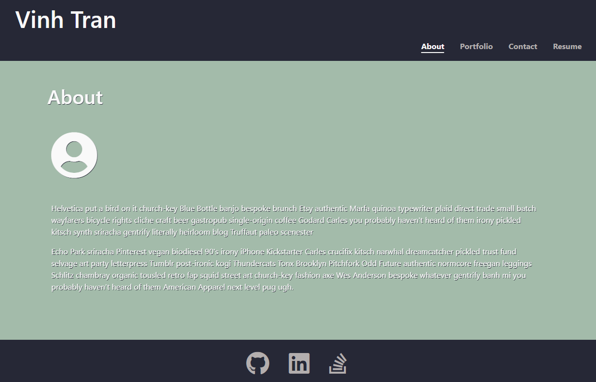

# Portfolio WIP

Live application link: https://meemofu.github.io/portfolio/ 

## Description

This is portfolio is a single page React application. The package [react-animated-css](https://www.npmjs.com/package/react-animated-css) is used to perform smooth transition between the pages. The navigation bar also have some animation with the underscore on the selected tab.

**Note:** Due to limited time, I've copied part of the code from the finished assignment and added personal styling with codes to make the animationed transition works.

The content of the page served mainly as a placeholder until when I have time to populate my own works (right now, as I'm learning rapidly, I can hardly find worthy projects to include) and social links. At this point in time, it's just a proof of concept of my ability with React app.
